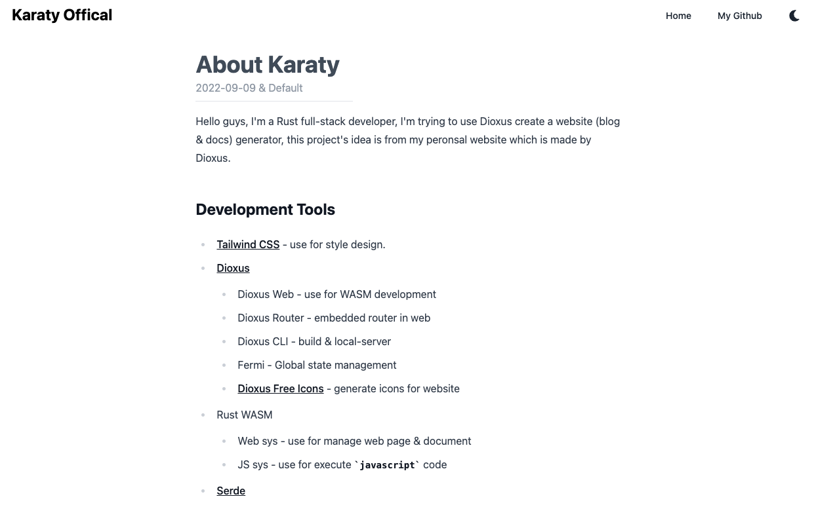
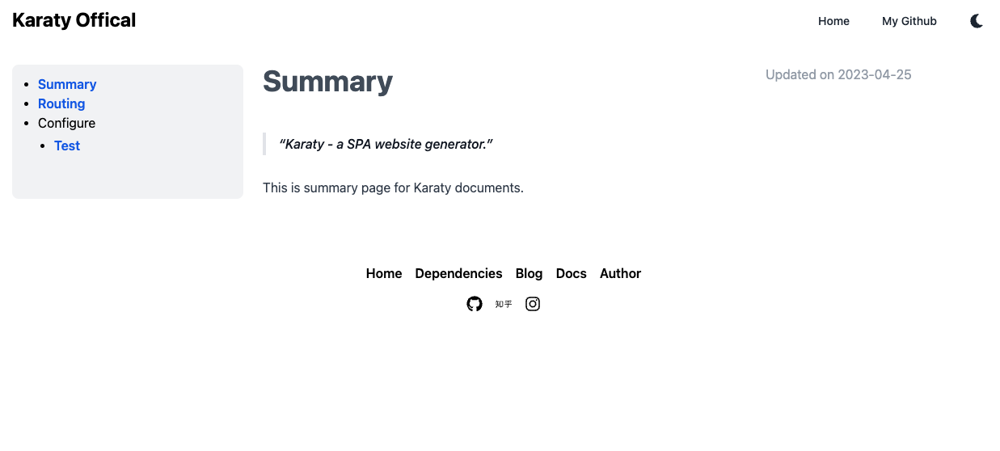

<div align="center">
  <h1>Karaty</h1>
</div>
<div align="center">
  <a href="https://karaty.mrxzx.info">在线演示与文档</a>
</div>

<div align="center">
  <h3>
    <span> 简体中文 </span>
    <span> | </span>
    <a href="https://github.com/mrxiaozhuox/karaty/blob/master/README.md"> English </a>
  </h3>
</div>


## Features

- 基于单个 `.wasm` 文件运行

- 无需编译或部署即可完成 **Markdown** 渲染
- 使用单个配置文件 `karaty.toml` 即可全面配置网站
- 可方便快捷的部署至 **GitHub Pages** 和 **静态文件服务器** 中
- 内置针对不同文件后缀的模板，快速搭建个人博客、文档等内容


## 启动项目

### 通过源码编译项目

安装 **dioxus-cli** 程序

```shell
cargo install dioxus-cli --git https://github.com/mrxiaozhuox/dioxus-cli
```

从 GitHub 克隆本项目

```shell
git clone https://github.com/mrxiaozhuox/karaty
```

启动 Dioxus Web 本地服务器

```shell
dioxus serve
```

### 通过已编译的文件部署

> 暂时未支持（需要编写 GitHub Acions 进行支持）


## 演示截图






#### 暗黑模式


